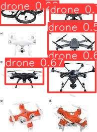

# Guidance of Code in Persian

This repository demonstrates the use of YOLOv8 for object detection tasks, focusing on detecting drones in image datasets.

## Features
- Efficient object detection using YOLOv8.
- Inference time metrics for each image.
- Modular design for reproducibility.

## Installation
1. Clone the repository:
    ```bash
    git clone https://github.com/your-username/yolov8-detection.git
    cd yolov8-detection
    ```
2. Install the required packages:
    ```bash
    pip install -r requirements.txt
    ```

## Usage
1. Place your image dataset in the `datasets/` folder.
2. Run the notebook in the `notebooks/` folder to perform object detection.
3. Results will be saved in the `runs/` directory.

## Repository Structure
```
yolov8-detection/
├── README.md          # Project overview and usage instructions
├── requirements.txt   # Python dependencies
├── notebooks/         # Jupyter Notebook for running the detection pipeline
├── scripts/           # Scripts for modular execution
└── datasets/          # Placeholder for input data (not included in the repo)
```

## Requirements
- Python 3.8 or later
- PyTorch 2.0 or later
- Ultralytics YOLOv8

## Acknowledgments
- YOLOv8 by Ultralytics: [GitHub](https://github.com/ultralytics/ultralytics)


## Results and Best Model
### Results
- Images showing detection results are located in the `results/` folder.
- A CSV file (`40ep-yolo-v8_model.csv`) contains the detailed detection metrics.

### Best Model
- The trained YOLOv8 model (`best.pt`) is saved in the `models/` folder.
- To use the model:
  ```bash
  python detect.py --weights models/best.pt --source datasets/<your_data>
  ```


## Documentation
- The `Guidance_of_Code_in_Persian.pdf` file in the `docs/` folder provides detailed guidance on the code in Persian.


## Detection Results

The trained YOLOv8 model was used to detect drones in test images. Below are some sample results:

### Sample Detection 1


### Sample Detection 2


### Metrics
- A detailed metrics report, including precision, recall, and confidence thresholds, is available in `./results/40ep-yolo-v8_model.csv`.


### CSV Metrics
The detailed metrics for the model's performance can be found in the `results/` folder as `40ep-yolo-v8_model.csv`.
